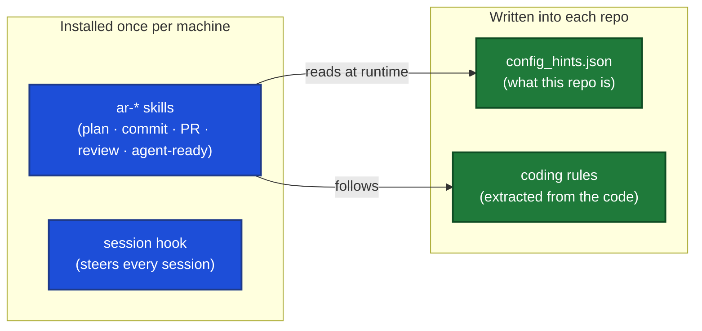

# Agentic Repos

**Make any repository agent-ready, so AI coding assistants follow your team's actual way of working instead of guessing.**

---

## The problem

You hand an AI coding assistant a task. It writes code that technically works but does not look like your codebase. It puts files in the wrong place, names things its own way, skips the tests you always write, invents an error-handling pattern you abandoned two years ago, and commits straight to `main`. So you fix it by hand, every time.

The next engineer opens the same repo and gets the same mess, because the assistant has no idea how *this* team works. Nobody wrote it down in a form the assistant can use. Everyone improvises. Every session starts from zero.

And it is worse across many repos. Each person copies a few helper scripts and half-remembered prompts onto their own laptop. Those copies drift. You improve something on your machine and nobody else ever gets it. A new repo, or a new laptop, means setting it all up again from scratch.

## The fix

Agentic Repos writes your team's way of working down **once**, in a form every AI session reads and follows **automatically**.

- It reads a repository and **extracts that repo's real conventions into rules** an assistant can follow, so output looks like your code, not generic code.
- It installs a **workflow that every session follows** the same way: read the rules, plan the change, write it on a branch, review it, open a PR. No more ad-hoc edits straight to `main`.
- It lives in **one place, shared by everyone**. Install it once per machine; update the whole team with `git pull`. Nothing to copy, nothing to drift.

## The one idea behind it

**How you work is the same in every repo. What each repo is differs.** So split them:

- **How (the procedure)** lives globally, installed once: the skills that plan tasks, commit, open PRs, review code, and keep a repo agent-ready. It is generic on purpose. It carries no stack, no company, no project specifics.
- **What (the config and rules)** lives in each repo: the coding rules extracted from that codebase, the build and test commands, the ticket tracker it uses.

The global procedure reads each repo's config at runtime. That is the whole trick: one shared copy of "how we work" serves every project, because each project simply declares what it is.



## How to use it

### 1. Install the global layer (once per machine)

Agentic Repos builds on [**agentic-devkit**](https://github.com/mahsanamin/agentic-devkit), which provides the reusable agents, the atomic commit/PR/review skills, and the worktree helpers. **agentic-devkit is required, not optional:** the `ar-*` skills call its agents (`a_sag_*`) and worktree helpers by name, so without it they fail at runtime. Install it once:

```bash
git clone https://github.com/mahsanamin/agentic-devkit ~/agentic-devkit
cd ~/agentic-devkit && ./install.sh && source ~/.zshrc
```

Then install Agentic Repos itself, either way:

**Option A: as a Claude Code plugin (recommended).** Git-based, versioned, and its hooks fire in every session automatically:

```
/plugin marketplace add mahsanamin/agentic-repos
/plugin install agentic-repos
```

Update the whole team with `/plugin marketplace update`. This gives you the `ar-*` driver skills, the session hook, and the default-branch guard. To make and maintain agent-ready repos, also clone the repo (Option B) so `/ar-install` has the rule templates and setup procedures. Plugin users get framework updates from `/plugin marketplace update` (the shell freshness nudge is Option B only).

**Option B: shell installer.** Also wires the shell helpers (worktree integration, the freshness check) that a plugin cannot:

```bash
git clone https://github.com/mahsanamin/agentic-repos ~/agentic-repos
cd ~/agentic-repos
./install.sh          # add --no-hooks if you already installed the plugin
source ~/.zshrc
```

`./install.sh` links the `ar-*` skills into `~/.claude/`, installs the session hook and the default-branch guard, and bootstraps agentic-devkit if it is missing. Re-run it after any `git pull`. Nothing gets copied into your projects. If you use the plugin for the Claude layer, run it with `--no-hooks` so the hooks are not wired twice.

### 2. Make a repo agent-ready (once per repo)

Inside a project, run the install command from Claude Code:

```
/ar-install
```

It reads the codebase, extracts its conventions into rule files, writes `config_hints.json` and `AGENTS.md`, and sets up the templates. From then on, every session in that repo is recognized as agent-ready and steered onto the workflow. To re-assess or refresh the rules later, run `ar-agent-ready`.

### 3. Do the work

Describe a task and let it run through the flow:

```
ar-taskflow
```

Raw prompt, then understand, then plan, then code, then document, then PR. On a branch. Reviewed. Following the rules that were extracted from your own repo.

## What you get

**Driver skills (`ar-*`, global):**

- `ar-taskflow` (+ `-planner`, `-resume`, `-review`, `-fix-comments`, `-remember`), the full task workflow from idea to reviewed PR.
- `ar-agent-ready`, read a repo, extract its rules, report a readiness scorecard.
- `ar-optimizer`, audit rule files for redundancy and staleness.
- `ar-ticket-creator`, one clean, PR-sized ticket in whatever tracker the repo uses.
- `ar-record-improvement` / `ar-add-improvement`, the feedback loop that lets the framework learn from real use.
- `ar-global-pr-reviewer`, review any GitHub PR from anywhere on your machine.
- `ar-init-skills`, `ar-init-mcps`, per-repo config bootstrap.

**Tracker-agnostic.** Each repo declares its tracker in `config_hints.json`: `github` (via the `gh` CLI, the default), `jira`, `linear`, or `none`. Skills never hardcode a tracker.

## Learn more

- [`docs/ARCHITECTURE.md`](./docs/ARCHITECTURE.md), the full model: the two layers, the devkit dependency, the session hook, rule extraction, and the feedback loop.
- [`CONTRIBUTING.md`](./CONTRIBUTING.md), how to add or change a skill, agent, or rule.
- [agentic-devkit](https://github.com/mahsanamin/agentic-devkit), the shared primitives this builds on.

## License

MIT. See [`LICENSE`](./LICENSE).
