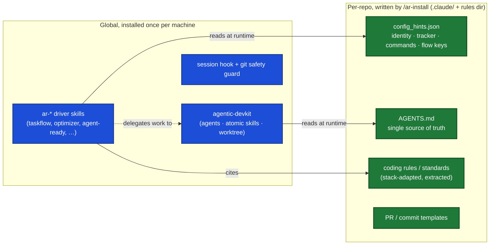
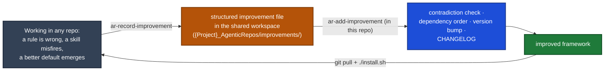

# Agentic Repos, Architecture

How the pieces fit, and the one idea everything else follows from.

## The one idea: procedure is global, configuration is local

A team of engineers should not each carry their own private copy of "how we work." The *how*, commit cleanly, open a PR, plan a task, review a diff, keep the repo agent-ready, is the same in every repository. Only the *what* changes per repo: the stack, the coding rules, the ticket tracker, the build command.

So Agentic Repos splits cleanly into two layers:

| Layer | What it is | Where it lives | Who installs it |
|---|---|---|---|
| **Procedure** (global) | The `ar-*` driver skills, the reusable agents, the scripts, the session hook and the git safety guard. Stack-agnostic by mandate. | Once per machine, under `~/.claude/`, `~/.agents/` and `~/.codex/` (as **symlinks** back into the source repos) | `./install.sh` for Claude Code, `./install-codex.sh` for Codex |
| **Config + Rules** (local) | `config_hints.json`, `AGENTS.md`, the stack-adapted coding rules, a `.claude/settings.json` permission posture, PR/commit templates. | Per repository, in that repo's `.claude/` and standards dir | `/ar-install` |

The procedure reads the config layer at runtime. That seam is the whole design: **one global copy of the procedure serves every repo, because each repo declares its own identity in `config_hints.json` and the procedure reads it live.**

## Two harnesses, one set of files

Claude Code and Codex both run this framework, and neither gets a copy of it. `install.sh` symlinks `skills/` into `~/.claude/skills/`; `install-codex.sh` symlinks the same directory into `~/.agents/skills/`. Edit a skill once and both harnesses see it on their next session. Nothing is generated, so nothing can drift and there is no mirror check to run before committing.

Agents are the one exception. Codex needs TOML and agentic-devkit ships Markdown, so `install-codex.sh` renders them into `~/.codex/agents/*.toml` on every run, from the devkit sources. The devkit stays the single source; a hand edit under `~/.codex/agents/` is overwritten.

The same principle applies to this repository's own instructions. `AGENTS.md` is the source of truth for working here, and `CLAUDE.md` is a two-line import of it. Repo-level guidance is added to `AGENTS.md`, never to `CLAUDE.md`, because a rule written in the Claude-only file is a rule Codex never reads. `/ar-install` writes target projects the same way.

The full mapping of paths, the rendered-agent model table, and the Codex trust step are in [`CODEX.md`](./CODEX.md).

## Why this repo depends on agentic-devkit

Agentic Repos does **not** ship its own agents, its own commit/PR/review skills, or its own worktree helpers. Those are general-purpose primitives, and they already live in [agentic-devkit](https://github.com/mahsanamin/agentic-devkit). Agentic Repos is the **AI-readiness layer on top**: the orchestration (`ar-taskflow`), the config seam, the rule extraction, and the install/upgrade flow.

So `install.sh` **requires agentic-devkit** and bootstraps it if missing. What comes from where:

| Need | Comes from | Not shipped here because |
|---|---|---|
| Code review, plan verify, commit/PR drafting, test running, doc writing | devkit agents (`a_sag_code_reviewer`, `a_sag_plan_verifier`, `a_sag_commit_writer`, `a_sag_pr_writer`, `a_sag_test_runner`, `a_sag_task_doc_writer`) | general-purpose producers, not AI-readiness specific |
| One-shot commit / open PR / review a PR / raise coverage | devkit skills (`a_sk_commit`, `a_sk_pr`, `a_sk_review_pr`, `a_sk_sonarqube_coverage`) | atomic dev actions, reused everywhere |
| Worktree management | devkit `a_g_worktree_*` | git ergonomics, not framework-specific |
| The global symlink install mechanism | devkit's `a_c_skills` / `a_c_agents` | one install engine for both repos |

`ar-*` skills invoke devkit agents by name. Because devkit is installed globally, those names resolve in every project. A role with no devkit agent is expressed as a bounded subagent described inline in the skill that needs it, never as a new agent in this repository.

## What Agentic Repos itself ships

Skills:

- **`ar-taskflow`** and family (`-planner`, `-resume`, `-review`, `-fix-comments`, `-remember`), the raw-prompt to understand to plan to code to document orchestrator.
- **`ar-agent-ready`**, assess a repo's agent-readiness and extract/expand its rules (see below).
- **`ar-optimizer`**, audit existing rule files for redundancy and staleness.
- **`ar-optimize-docs`**, **`ar-optimize-doc-comments`**, **`ar-optimize-inline-comments`**, **`ar-optimize-tests`**, audit standalone documents, declaration-attached blocks, in-body comments, and test cost. They partition one codebase and defer any finding outside their own half.
- **`ar-sonar-sweep`**, drive a static-analysis backlog to zero in bounded, reviewable batches.
- **`ar-ticket-creator`**, one PR-sized ticket in whatever tracker the repo declares.
- **`ar-record-improvement`** / **`ar-add-improvement`**, the feedback loop (below).
- **`ar-init-skills`**, **`ar-init-mcps`**, per-project config bootstrap.
- **`ar-global-pr-reviewer`**, **`ar-api-dd-compare`**, **`ar-dd-api-performance`**, cross-repo review and observability skills.
- Operator commands: **`ar-install`**, **`ar-upgrade`**, **`ar-add-improvement`**, **`ar-self-reviewer`**, **`ar-install-context`**.

Universal rules, adapted per stack by the installer and written into each repo's `standards_location`: code review, the three test policies (`test-change-policy`, `test-scope-policy`, `test-layer-policy`), `lean-docs`, `lean-doc-comments`, `lean-inline-comments`, `delegation-and-cost` (which model tier does bulk reading), `diagram-output-medium`, `seed-vs-migration-jobs`, and `task-flow-startup`.

## Rule extraction: making a repo agent-ready

An AI agent is only as good as the rules it's handed. A repo with no written conventions gets ad-hoc, inconsistent output. So a first-class job of Agentic Repos is to **read a codebase and extract its conventions into rules** that every session then follows.

`/ar-install` does this at adoption time and **`ar-agent-ready`** does it on demand:

1. **Explore** the codebase (delegating to devkit's `a_sag_codebase_explorer`) to learn its real structure, stack, and conventions.
2. **Extract** those conventions into stack-adapted rule files under the repo's `standards_location`.
3. **Wire** the config seam (`config_hints.json`, `AGENTS.md`) so every `ar-*` skill reads them.
4. **Govern** future sessions with the session hook, so the rules are actually applied rather than ignored.

The rules are the repo's editable surface, extracted as a strong starting point, then owned by the team.

## The session hook: every session, same practice

Installing rules is useless if sessions ignore them. So the install wires a **`SessionStart` hook** into `~/.claude/settings.json`. On every new session, in any repo, the hook checks whether the current project is agent-ready (has `config_hints.json` / `AGENTS.md`) and, if so, injects a short reminder to follow the agent-ready workflow, read the rules, use `ar-taskflow` for real work, record improvements. This is what turns "we have rules" into "everyone works the same way," without anyone remembering to opt in.

## The git safety guard: one predicate, both harnesses

`scripts/ar-session/guard-default-branch.sh` is wired as a `PreToolUse(Bash)` hook globally. Claude Code gets it from `~/.claude/settings.json` (written by `install.sh` or the plugin, never per repo); Codex gets it from a repo's `.codex/hooks.json` (written by `install-codex.sh --target`). The script reads the hook payload on stdin, which both harnesses deliver in the same shape, and exits 2 to refuse.

One script matters more than the list of refusals, because a policy expressed twice is a policy that will eventually disagree with itself. One script means one behaviour and one regression suite.

It refuses force-pushes anywhere, `git push --all` and `--mirror`, a `--force-with-lease` or rebase onto a shared branch or from a detached HEAD, whole-tree discards, `git reset --hard/--merge/--keep`, `git clean` without a dry run, and any commit or push that would land on the default branch. The in-progress rebase verbs always pass. The authoritative list, in the order it is checked, is the header of the script itself; do not copy it into a second document.

Two design points:

- **It degrades by scope, not open or closed.** If the payload cannot be read, it refuses git commands and allows everything else with a warning. A blanket refusal would block `ls`; a blanket allow would drop protection on exactly the commands that need it.
- **It is a seatbelt, not a security boundary.** It statically inspects an arbitrary shell string, which cannot be made sound: subshells, `bash -c` and decoy `cd` can evade it. The authoritative control is server-side branch protection on the default branch.

## Permissions: where an entry goes

The shipped `settings.json` and `templates/settings.template.json` follow one rule:

- **`deny`** holds only what must never run.
- **`ask`** holds the operator decisions where a human's answer in the moment changes the outcome, such as merging a PR or deleting a branch or a volume. None of them sits on the normal task flow.
- **`allow`** holds everything else, stack-neutral and never pruned per project, so a repo that gains a second language does not start prompting.

Safety is deliberately absent from this file. A permission entry is a prefix match: it cannot stop `bash -c` or a rephrased command, so it is defense in depth and never the boundary. That is what lets `git` and `gh` be allowed wholesale while the guard does the real work. Codex's mirror of this posture is `.codex/config.toml` with `approval_policy = "on-request"` and `sandbox_mode = "workspace-write"`.

## Agent-to-agent exchanges are bounded

An automated reviewer and an automated fixer working the same PR would otherwise trade rounds forever, each one looking like progress. They share `review.max_agent_rounds` (default 3), defined in `rules/universal/code-review.md`.

Rounds are counted from the markers each side puts in what it posts, `<!-- ar-review round=N -->` and `<!-- ar-fix round=N commit=SHA -->`, so a fresh session computes the same number and neither prose nor the posting account is parsed. Past the budget, `ar-taskflow-fix-comments` stops with `ROUND CAP` and `ar-global-pr-reviewer` posts one summary, and a human decides whether the PR continues, splits, or changes approach. Green CI does not extend the budget and neither does the two sides agreeing.

## Autonomous mode is a config key, not a mode of the framework

`flow.autonomous` in a repo's `config_hints.json` is opt-in and defaults to false. When it is on, `ar-taskflow` clears its judgement checkpoints with independent verifier subagents and a bounded repair loop instead of with a human, and escalates only a decision the ticket and the code do not answer. It costs three extra fresh-context round-trips per task.

It changes who verifies, not what is enforced: the guard, the acceptance-criteria gate and the permission posture are identical in both modes. `GUIDE.md` has the operator's version, including how it relates to the unchanged `/goal` and `flow.continuous` mechanisms.

## The feedback loop: record → add

The framework improves itself from real use.

- **`ar-record-improvement`**, global, invocable from inside any repo the moment a limitation surfaces. Writes a structured file; never edits the framework directly.
- **`ar-add-improvement`**, run inside this repo to triage the pending set: check for contradictions first, apply in dependency order, bump the version, update the CHANGELOG.

## Delivery: three paths, no re-copy

None of these copies files into your projects:

1. **Claude Code plugin.** The repo is a plugin marketplace (`.claude-plugin/marketplace.json` + `plugin.json`). `/plugin marketplace add mahsanamin/agentic-repos` then `/plugin install agentic-repos` delivers the `ar-*` driver skills and the hooks (`hooks/hooks.json`, which fire in every session at user scope). Versioned, updated with `/plugin marketplace update`. A plugin cannot source shell functions or wire an arbitrary `~/.claude` hook, so the worktree shell helpers and the freshness check come from agentic-devkit + `install.sh`.
2. **`install.sh` (symlink).** Links the `ar-*` skills into `~/.claude/` and wires the hooks + shell helpers. Updating is `git pull` + re-run (idempotent). Use `--no-hooks` if the plugin already provides them.
3. **`install-codex.sh` (symlink + rendered agents).** The Codex half: the same `skills/` into `~/.agents/skills/`, the scripts and hints onto the Codex path, a marker-guarded block in `~/.codex/AGENTS.md`, and the devkit agents rendered as TOML. `--target` adds a repo's `.codex/config.toml` and guard hook; `--target-only` leaves the global layer alone.

Either way, eval sets for skills are committed in the repo and shipped as data, never regenerated per machine.

To make and maintain agent-ready repos, the framework content (`setup.md`, `rules/`, `templates/`) must be present, so operator commands like `/ar-install` run from a clone (or the plugin root).

## Verification: the contract suites

`scripts/ar-lint/` holds the suites that hold the moving parts to their contracts:

| Suite | Cases | Asserts |
|---|---|---|
| `git-guard-cases.sh` | 47 | every refusal the guard makes, and every command it must NOT block |
| `install-cases.sh` | 23 | `install.sh` against a disposable HOME, including that a second run is byte-identical |
| `codex-install-cases.sh` | 34 | `install-codex.sh`, including the registered hook event and matcher |

`./install-codex.sh --check-only` syntax-checks the shipped scripts and runs all three. It installs nothing. Run it before shipping any change to a script, an installer, a hook or either settings file; a focused change can run just the suite it touches, as long as the report says what was not exercised.

The hook contract (the `PreToolUse` event, the `Bash` tool name, and `tool_input.command`) is fixed by each harness's own documentation. A suite catches a change on this side. It cannot catch a rename on the harness side, so re-read the hooks documentation when bumping a pinned CLI.
