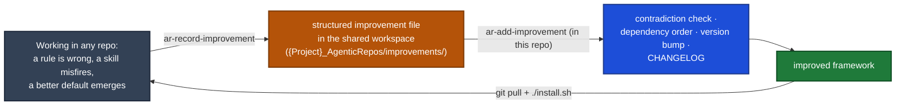

# Agentic Repos, Architecture

How the pieces fit, and the one idea everything else follows from.

## The one idea: procedure is global, configuration is local

A team of engineers should not each carry their own private copy of "how we work." The *how*, commit cleanly, open a PR, plan a task, review a diff, keep the repo agent-ready, is the same in every repository. Only the *what* changes per repo: the stack, the coding rules, the ticket tracker, the build command.

So Agentic Repos splits cleanly into two layers:

| Layer | What it is | Where it lives | Who installs it |
|---|---|---|---|
| **Procedure** (global) | The `ar-*` driver skills, the reusable agents, the shell/git helpers. Stack-agnostic by mandate. | Once per machine, under `~/.claude/` (as **symlinks** back into the source repos) | `./install.sh` |
| **Config + Rules** (local) | `config_hints.json`, `AGENTS.md`, the stack-adapted coding rules, an autonomous `.claude/settings.json` (permissions only), PR/commit templates. | Per repository, in that repo's `.claude/` and standards dir | `/ar-install` |

The procedure reads the config layer at runtime. That seam is the whole design: **one global copy of the procedure serves every repo, because each repo declares its own identity in `config_hints.json` and the procedure reads it live.**

## Why this repo depends on agentic-devkit

Agentic Repos does **not** ship its own agents, its own commit/PR/review skills, or its own worktree helpers. Those are general-purpose primitives, and they already live in [agentic-devkit](https://github.com/mahsanamin/agentic-devkit). Agentic Repos is the **AI-readiness layer on top**: the orchestration (`ar-taskflow`), the config seam, the rule extraction, and the install/upgrade flow.

So `install.sh` **requires agentic-devkit** and bootstraps it if missing. What comes from where:

| Need | Comes from | Not shipped here because |
|---|---|---|
| Code review, plan verify, commit/PR drafting, test running, doc writing | devkit agents (`a_sag_code_reviewer`, `a_sag_plan_verifier`, `a_sag_commit_writer`, `a_sag_pr_writer`, `a_sag_test_runner`, `a_sag_task_doc_writer`) | general-purpose producers, not AI-readiness specific |
| One-shot commit / open PR / review a PR / raise coverage | devkit skills (`a_sk_commit`, `a_sk_pr`, `a_sk_l_review_pr`, `a_sk_sonarqube_coverage`) | atomic dev actions, reused everywhere |
| Worktree management | devkit `a_g_worktree_*` | git ergonomics, not framework-specific |
| The global symlink install mechanism | devkit's `a_c_skills` / `a_c_agents` | one install engine for both repos |

`ar-*` skills invoke devkit agents by name via the Task tool. Because devkit is installed globally, those names resolve in every project.

## What Agentic Repos itself ships

- **`ar-taskflow`** and family (`-planner`, `-resume`, `-review`, `-fix-comments`, `-remember`), the raw-prompt → understand → plan → code → document orchestrator.
- **`ar-agent-ready`**, assess a repo's agent-readiness and extract/expand its rules (see below).
- **`ar-optimizer`**, audit existing rule files for redundancy and staleness.
- **`ar-ticket-creator`**, one PR-sized ticket in whatever tracker the repo declares.
- **`ar-record-improvement`** / **`ar-add-improvement`**, the feedback loop (below).
- **`ar-init-skills`**, **`ar-init-mcps`**, per-project config bootstrap.
- **`ar-global-pr-reviewer`**, **`ar-api-dd-compare`**, **`ar-dd-api-performance`**, cross-repo review and observability skills.
- Operator commands: **`ar-install`**, **`ar-upgrade`**, **`ar-add-improvement`**, **`ar-self-reviewer`**, **`ar-install-context`**.

## Rule extraction: making a repo agent-ready

An AI agent is only as good as the rules it's handed. A repo with no written conventions gets ad-hoc, inconsistent output. So a first-class job of Agentic Repos is to **read a codebase and extract its conventions into rules** that every session then follows.

`/ar-install` does this at adoption time and **`ar-agent-ready`** does it on demand:

1. **Explore** the codebase (delegating to devkit's `a_sag_codebase_explorer`) to learn its real structure, stack, and conventions.
2. **Extract** those conventions into stack-adapted rule files under the repo's `standards_location`.
3. **Wire** the config seam (`config_hints.json`, `AGENTS.md`) so every `ar-*` skill reads them.
4. **Govern** future sessions with the session hook, so the rules are actually applied rather than ignored.

The rules are the repo's editable surface, extracted as a strong starting point, then owned by the team.

## The session hook: every session, same practice

Installing rules is useless if sessions ignore them. So the install wires a **`SessionStart` hook** into `~/.claude/settings.json`. On every new session, in any repo, the hook checks whether the current project is agent-ready (has `config_hints.json` / `AGENTS.md`) and, if so, injects a short reminder to follow the agent-ready workflow, read the rules, use `ar-taskflow` for real work, record improvements. This is what turns "we have rules" into "everyone works the same way," without anyone remembering to opt in.

A **default-branch / force-push guard** (`PreToolUse`) is wired globally alongside it (by `install.sh` or the plugin, never per repo): it refuses commits/pushes on the default branch and blocks force-push. It is a best-effort seatbelt, not a security boundary. It statically inspects an arbitrary shell string, so a determined command can evade it. The authoritative control is server-side GitHub branch protection on the default branch (require a PR, block direct and force pushes); enable that on any repo that matters.

## The feedback loop: record → add

The framework improves itself from real use.

- **`ar-record-improvement`**, global, invocable from inside any repo the moment a limitation surfaces. Writes a structured file; never edits the framework directly.
- **`ar-add-improvement`**, run inside this repo to triage the pending set: check for contradictions first, apply in dependency order, bump the version, update the CHANGELOG.

## Delivery: two paths, no re-copy

There are two ways to install the global layer, and neither copies files into your projects:

1. **Claude Code plugin (recommended).** The repo is a plugin marketplace (`.claude-plugin/marketplace.json` + `plugin.json`). `/plugin marketplace add mahsanamin/agentic-repos` then `/plugin install agentic-repos` delivers the `ar-*` driver skills and the hooks (`hooks/hooks.json`, which fire in every session at user scope). Versioned, updated with `/plugin marketplace update`. A plugin cannot source shell functions or wire an arbitrary `~/.claude` hook, so the worktree shell helpers and the freshness check come from agentic-devkit + `install.sh`.
2. **`install.sh` (symlink).** Links the `ar-*` skills into `~/.claude/` and wires the hooks + shell helpers. Updating is `git pull` + re-run (idempotent). Use `--no-hooks` if the plugin already provides them.

Either way, eval sets for skills are committed in the repo and shipped as data, never regenerated per machine.

To make and maintain agent-ready repos, the framework content (`setup.md`, `rules/`, `templates/`) must be present, so operator commands like `/ar-install` run from a clone (or the plugin root).
